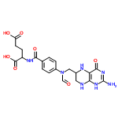
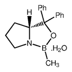
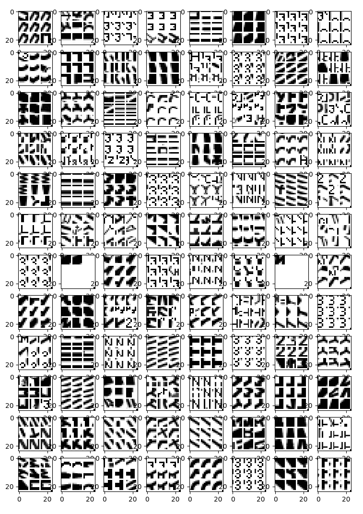

LewisNet-1
==========

A convolutional neural network for recognizing Organic Chemical Lewis Structures build with Google's [Tensorflow](https://github.com/tensorflow/tensorflow).

This is modified from the [AlexNet](https://papers.nips.cc/paper/4824-imagenet-classification-with-deep-convolutional-neural-networks.pdf) architecture, with similar modifications to [this paper](https://arxiv.org/pdf/1311.2901.pdf).

99% accuracy was achieved on the test set with only 3 epochs.

## Why Build This

There are hundreds of thousands of academic Chemistry papers.
Some services like Reaxys and SciFinder index these papers to allow you to search by chemical structures or reactions.
I would like to automate the process of identifying chemical structures in these papers, to make these indexes easier to maintain.

This involves two steps:
1. Object detection - find the location of chemical structures within papers
1. Identification - not just classification, but determining the actual chemical formula

This project is the first step. It can classify Lewis structures from *non* Lewis structures.

## Data Gathering

Some of the positives were gathered from the [ChemSpider API](http://www.chemspider.com/).
I downloaded the first 10,000 images (by ascending integer ID).
Some of the negatives were taken from papers without chemical structures in them, about 9,000 images.
Papers were converted to PNGs and cropped into 150x150 tiles.
For each class, several thousand were downloaded and labelled manually from Google images.
This was done with a Chrome Extension called [Label Gun](https://github.com/acarl005/label-gun).

## Training

The network was trained on a Lenovo U31-70 with a NVIDIA GeForce 920M running Ubuntu 16.04.3.

## Hidden Layer Visualizations

Here we find the top 9 pieces of the input space that maximize activation in each filter. This gives us an idea what each filter is "looking for". The negatives were excluded in this visualization.

### Hidden layer 1

This layer appears to be detecting simple things like curves, edges, vertices, and individual letters/numbers.

This layer is detecting more complex things like methyl groups, allyl groups, quaternary carbons, aromatic rings, amines, carbonyls, etc.
Notice that quite a few of the units are all blank, meaning there was no activation whatsoever for all the positive images. These units are probably stimulated by salient features in the negatives.

### Hidden layer 2

### Hidden layer 3

Coming soon!
