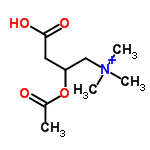
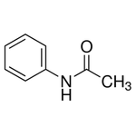

LewisNet-1
==========

A convolutional neural network for recognizing Organic Chemical Lewis Structures build with Google's [Tensorflow](https://github.com/tensorflow/tensorflow).

This is modified from the [AlexNet](https://papers.nips.cc/paper/4824-imagenet-classification-with-deep-convolutional-neural-networks.pdf) architecture.

99% accuracy was achieved on the test set with only 3 epochs.

## Why Build This

There are hundreds of thousands of academic Chemistry papers.
Some services like Reaxys and SciFinder index these papers to allow you to search by chemical structures or reactions.
I would like to automate the process of identifying chemical structures in these papers, to make these indexes easier to maintain.

This involves two steps:
1. Object detection - find the location of chemical structures within papers
1. Identification - not just classification, but determining the actual chemical formula

This project is the first step. It can classify Lewis structures from *non* Lewis structures.

## Data Gathering

Some of the positives were gathered from the [ChemSpider API](http://www.chemspider.com/).
I downloaded the first 10,000 images (by ascending integer ID).
Some of the negatives were taken from papers without chemical structures in them, about 9,000 images.
Papers were converted to PNGs and cropped into 150x150 tiles.
For each class, several thousand were downloaded and labelled manually from Google images.

## Training

The network was trained on a 2015 Macbook Pro with an Intel i7 CPU.

## Architecture

